# 📝 TaskFlow - Todo List App

**TaskFlow** là một ứng dụng quản lý công việc (Todo List) hiện đại, trực quan và tối ưu hiệu suất cá nhân, được xây dựng trên nền tảng **Flutter** sử dụng mô hình quản lý trạng thái **BLoC** kết hợp với kiến trúc **Clean Architecture**.

Ứng dụng không chỉ là nơi lưu trữ công việc hàng ngày mà còn tích hợp các công cụ hỗ trợ thông minh như **Hẹn giờ tập trung (Pomodoro)**, **Thống kê hiệu suất trực quan**, **Hỗ trợ đa ngôn ngữ**, và **Tích hợp Trí tuệ Nhân tạo (Gemini AI)**.

---

## 🌟 Tính năng Nổi bật

### 1. Quản lý Công việc & Phân loại thông minh
*   **Danh mục công việc (Task Folders):** Tự động phân loại công việc theo thời gian và mức độ ưu tiên như: *Hôm nay*, *Đã lên lịch*, *Tất cả*, *Quan trọng*, *Đã xong*.
*   **Tìm kiếm & Thao tác nhanh:** Bộ tìm kiếm thời gian thực giúp lọc nhanh công việc cùng thanh thêm nhanh (Quick Add Bar).
*   **Chi tiết công việc nâng cao:** Hỗ trợ mô tả chi tiết, thiết lập hạn chót (Due date), mức độ ưu tiên, đính kèm tệp/hình ảnh, ghi âm và chuyển giọng nói thành văn bản.

### 2. Trình Hẹn giờ Tập trung (Pomodoro)
*   Tích hợp trình đếm ngược thời gian tập trung (25 phút mặc định hoặc tùy chỉnh) liên kết trực tiếp với từng công việc cụ thể, giúp tăng tối đa năng suất làm việc và học tập.

### 3. Thống kê Hiệu suất trực quan (Analytics)
*   Bảng phân tích hiệu suất hoàn thành công việc theo dạng biểu đồ tuần, thống kê tỷ lệ phần trăm nhiệm vụ đã xong, số lượng công việc còn tồn đọng và tổng thời gian tập trung tích lũy.

### 4. Cá nhân hóa & Tiện ích nâng cao
*   **Dark Mode / Light Mode:** Chuyển đổi giao diện sáng/tối linh hoạt, phối màu dịu mắt, cao cấp.
*   **Tùy chỉnh cỡ chữ:** Linh hoạt phóng to/thu nhỏ kích thước văn bản hệ thống từ `0.85x` đến `1.3x` phù hợp với mọi đối tượng người dùng.
*   **Đa ngôn ngữ:** Hỗ trợ chuẩn hóa đa ngôn ngữ (Tiếng Việt, Tiếng Hàn...).
*   **Thùng rác thông minh:** Lưu trữ tạm thời các công việc đã xóa và tự động dọn dẹp sau 30 ngày để tránh mất mát dữ liệu ngoài ý muốn.
*   **Hỗ trợ Gemini AI:** Cấu hình khóa API Gemini AI để kích thích các tính năng thông minh tự động hóa nội dung và đề xuất công việc.

---

## 📸 Giao diện Minh họa

### 1. Màn hình Chào mừng & Trang chủ (Giao diện Sáng)
Giao diện sáng tinh tế, tối giản theo ngôn ngữ thiết kế hiện đại, bố cục khoa học giúp người dùng dễ dàng bao quát công việc.

<p align="center">
  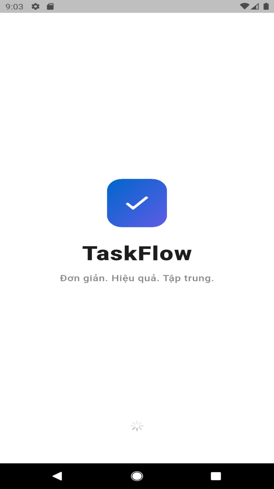
  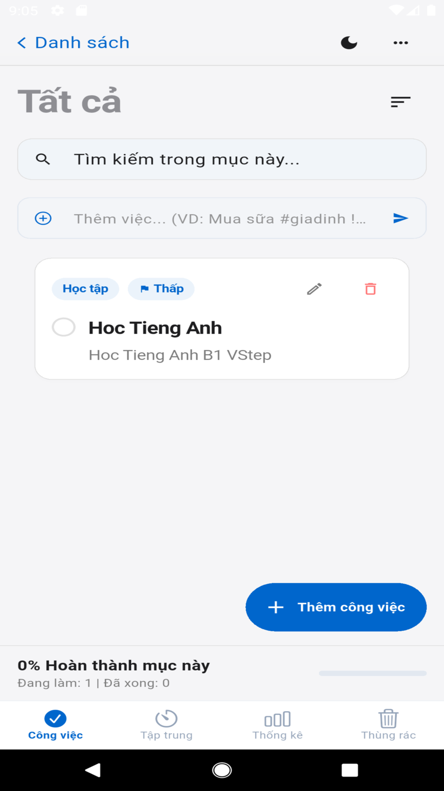
  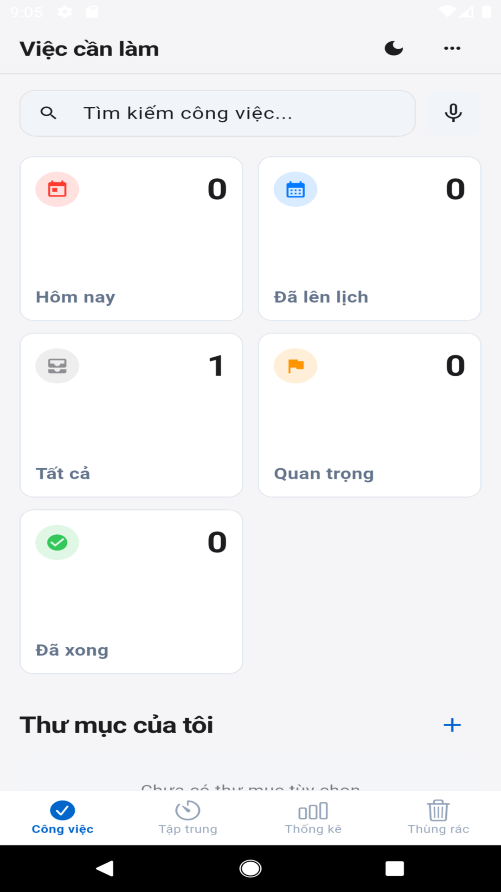
</p>

### 2. Các Tính năng Năng suất (Giao diện Sáng)
Trình hẹn giờ Pomodoro trực quan, biểu đồ thống kê kết quả làm việc chi tiết và khu vực Thùng rác bảo vệ dữ liệu.

<p align="center">
  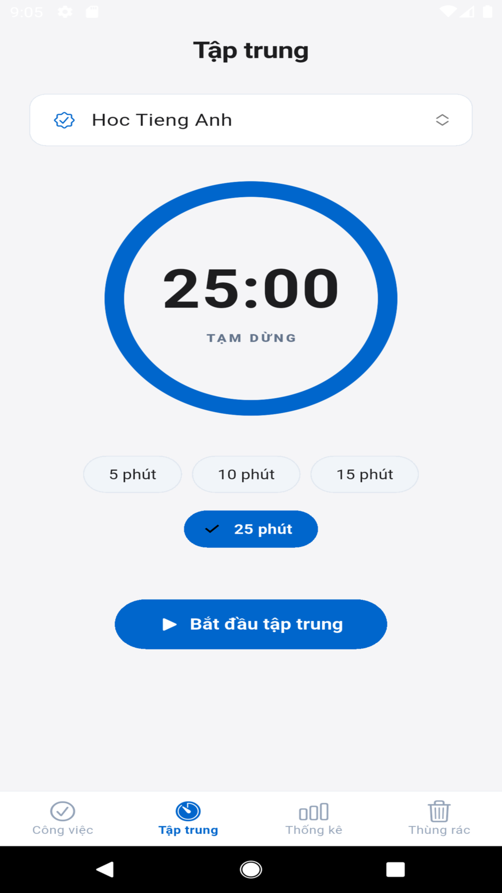
  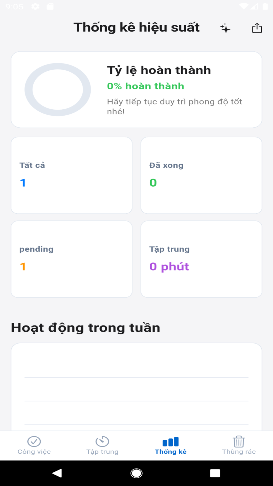
  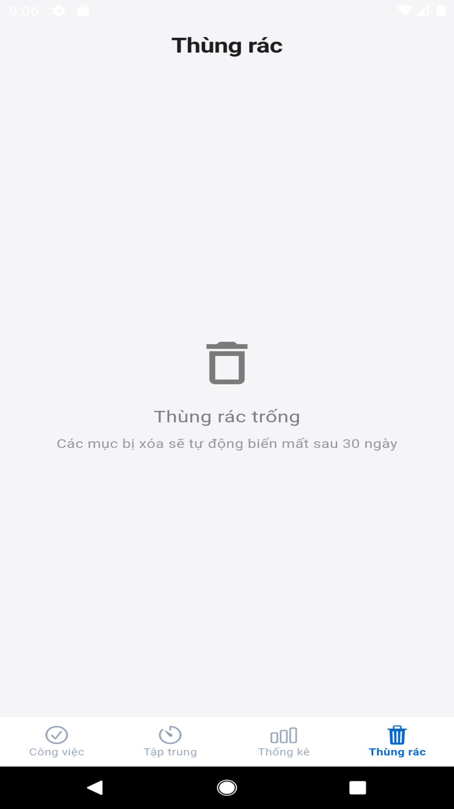
</p>

### 3. Giao diện tối & Tùy chọn Menu (Giao diện Tối)
Chế độ tối (Dark Mode) giúp bảo vệ mắt khi sử dụng vào ban đêm và mang lại cảm giác cực kỳ cao cấp, huyền bí.

<p align="center">
  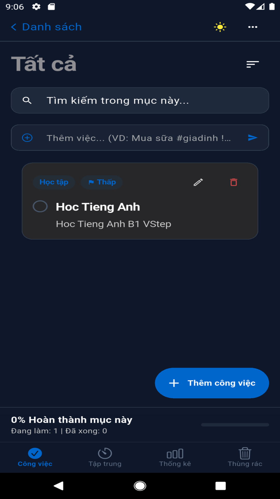
  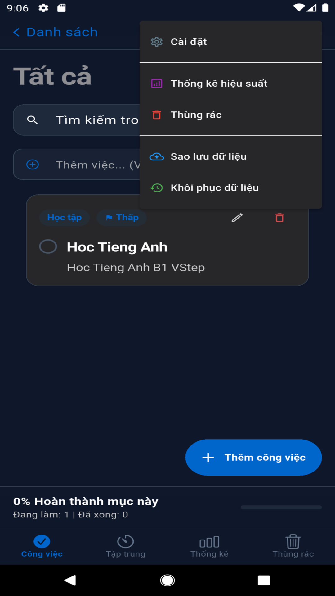
</p>

### 4. Thiết lập & Tùy biến Hệ thống
Hệ thống cài đặt trực quan cho phép thay đổi cấu hình hiển thị, kích thước chữ hệ thống và cấu hình Gemini AI.

<p align="center">
  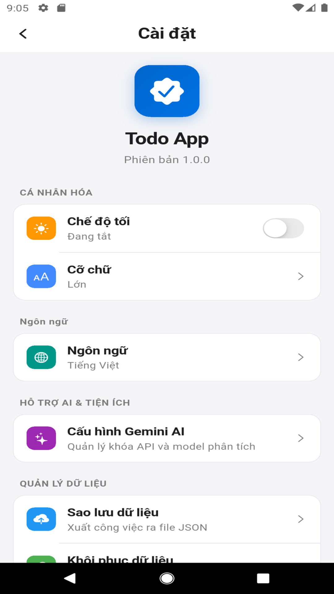
  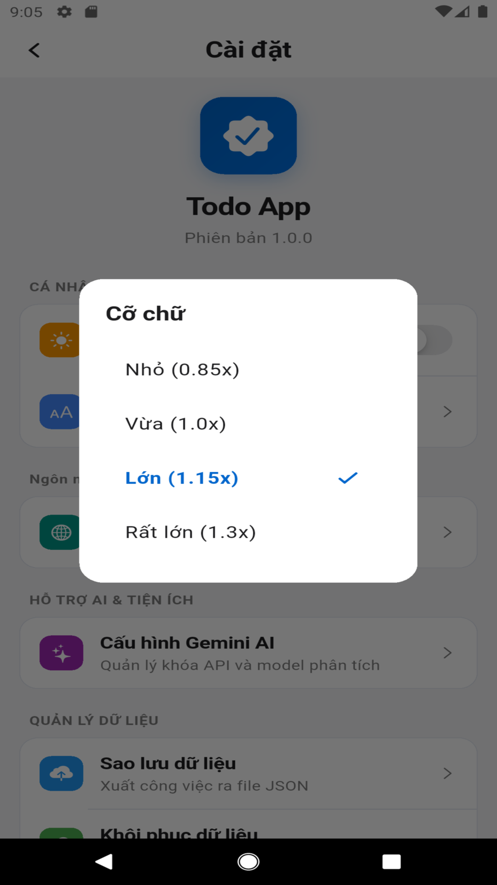
  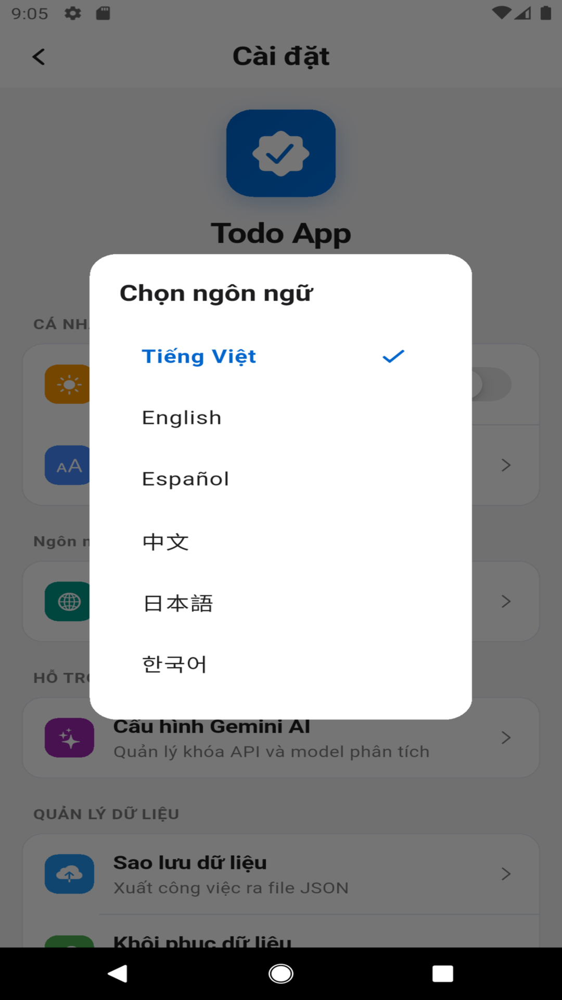
</p>

### 5. Hỗ trợ Đa ngôn ngữ (Minh họa tiếng Hàn)
Hệ thống dịch thuật toàn vẹn cho toàn bộ các màn hình chính bao gồm Cài đặt, Danh sách, Tập trung, Phân tích và Thùng rác.

<p align="center">
  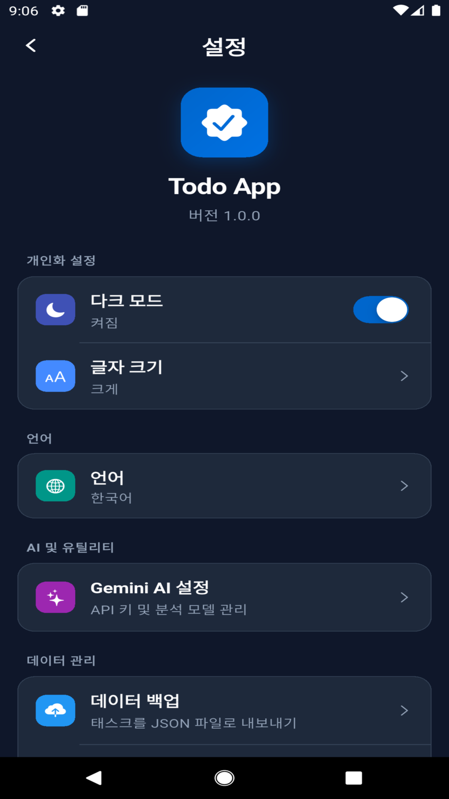
  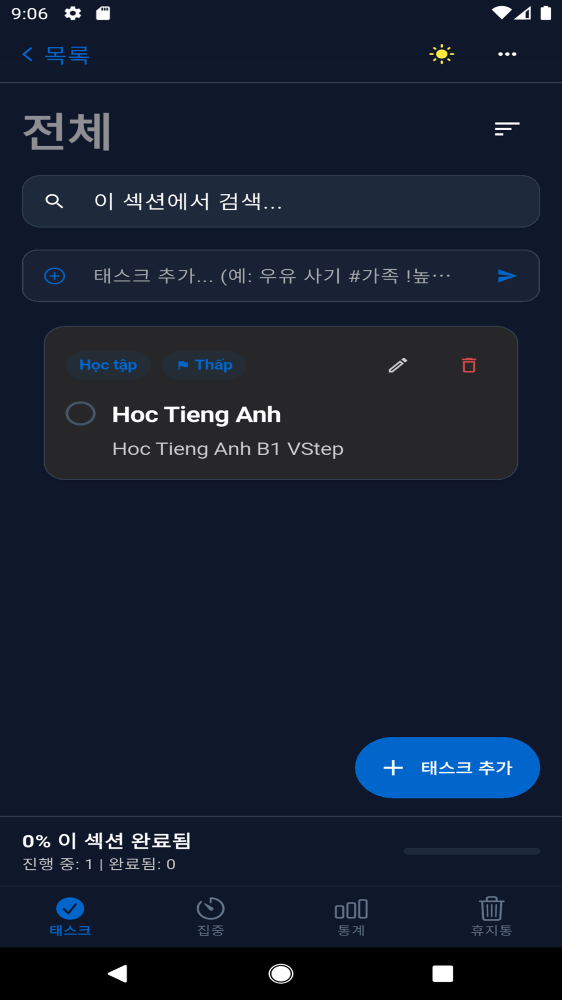
  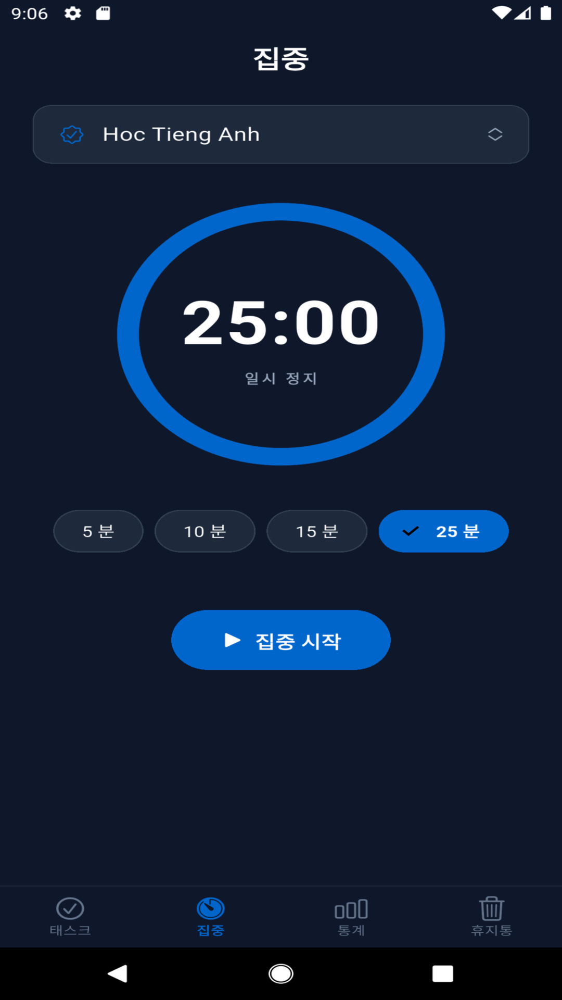
  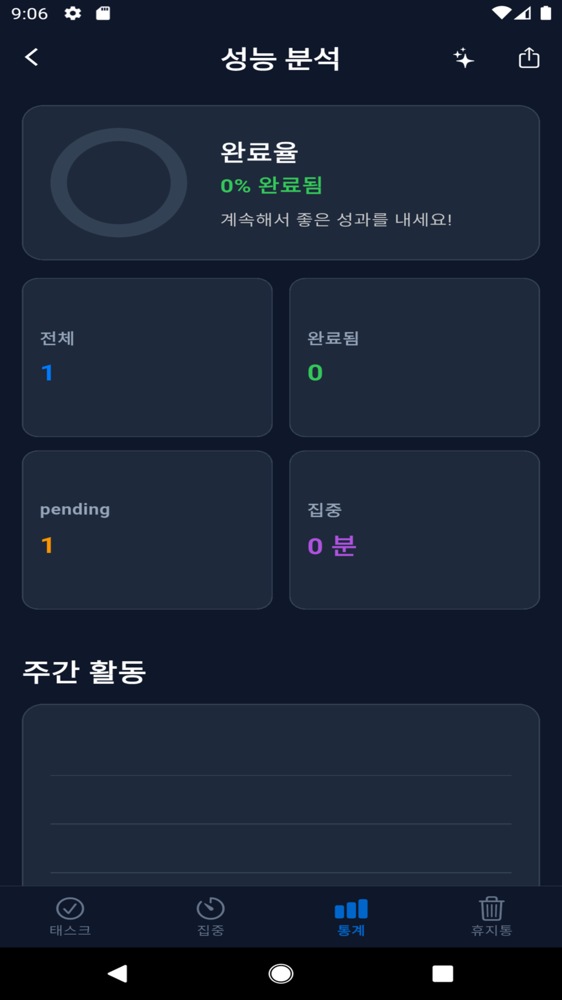
  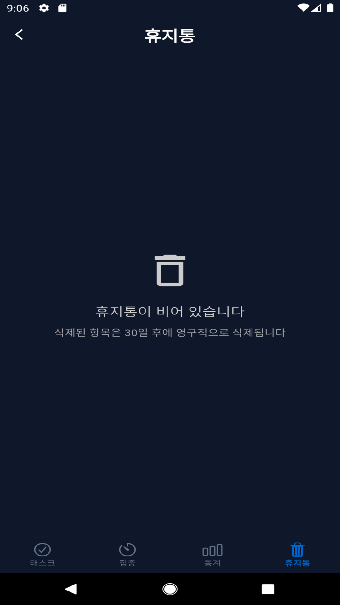
</p>

---

## 🛠️ Công nghệ Sử dụng

### Công nghệ Cốt lõi:
*   **Flutter (SDK ^3.9.0):** Bộ công cụ phát triển giao diện người dùng đa nền tảng.
*   **Dart:** Ngôn ngữ lập trình hướng đối tượng mạnh mẽ.

### Thư viện & Package chính:
*   **Quản lý trạng thái:** `flutter_bloc` (^8.1.3) kết hợp `equatable` (^2.0.5) cho cấu trúc Reactive State Management sạch sẽ, tối ưu hóa quá trình re-build UI.
*   **Dependency Injection:** `get_it` (^7.6.7) quản lý đăng ký và gọi Service/Repository ở mọi nơi trong ứng dụng.
*   **Lập trình hàm (Functional Programming):** `dartz` (^0.10.1) hỗ trợ xử lý ngoại lệ an toàn qua kiểu dữ liệu `Either`.
*   **Lưu trữ dữ liệu:** `shared_preferences` (^2.5.3) lưu trữ nhanh cấu hình ứng dụng và danh sách công việc cục bộ.
*   **Thông báo & Lịch trình:** `flutter_local_notifications` (^17.0.0) kết hợp `timezone` (^0.9.0) để nhắc nhở hạn chót công việc.
*   **Đầu vào đa phương tiện:** `image_picker` (^1.0.0), `file_picker` (^8.0.0), `record` (^7.0.0) ghi âm công việc, `audioplayers` (^6.0.0) phát lại âm thanh ghi âm, và `speech_to_text` (^7.4.0) nhập liệu rảnh tay.
*   **Trí tuệ nhân tạo:** `google_generative_ai` (^0.4.0) kết nối với mô hình Gemini AI.

---

## 🏗️ Cấu trúc Dự án (Clean Architecture)

Mã nguồn được phân tách rõ ràng thành các tầng (layers) độc lập giúp dễ dàng bảo trì, mở rộng và viết unit test:

```text
lib/
├── main.dart                  # Điểm khởi chạy ứng dụng
├── core/                      # Các cấu hình dùng chung (Themes, DI, Utils, Services)
│   ├── di/                    # Khởi tạo Dependency Injection (injection.dart)
│   ├── services/              # Các dịch vụ hệ thống (Notification, Audio...)
│   └── theme/                 # Cấu hình giao diện Light/Dark Theme
├── domain/                    # Tầng Nghiệp vụ (Business Logic) - Độc lập hoàn toàn
│   ├── entities/              # Các thực thể dữ liệu (Todo, List, Category...)
│   ├── repositories/          # Khai báo interface cho Repository
│   └── usecases/              # Các kịch bản nghiệp vụ chi tiết
├── data/                      # Tầng Dữ liệu (Data Access) - Hiện thực hóa Domain
│   ├── models/                # Chuyển đổi dữ liệu JSON/DTO
│   ├── datasources/           # Đọc/ghi dữ liệu cục bộ hoặc từ API
│   └── repositories/          # Hiện thực hóa các interface từ Domain
└── presentation/              # Tầng Giao diện (UI)
    ├── pages/                 # Các màn hình chính (Home, Settings, Focus, Detail...)
    └── widgets/               # Các Widget tái sử dụng (Dropdown, Task Card...)
```

---

## 🚀 Hướng dẫn Cài đặt & Chạy ứng dụng

### Yêu cầu hệ thống:
*   Đã cài đặt **Flutter SDK** phiên bản `>= 3.9.0`.
*   Thiết bị giả lập (Emulator) hoặc thiết bị thật kết nối qua cổng USB Debugging.

### Các bước thực hiện:

1. **Clone mã nguồn ứng dụng:**
   ```bash
   git clone https://github.com/Huy2004P/todo_list_app.git
   cd todo_list_app
   ```

2. **Cài đặt các thư viện phụ thuộc:**
   ```bash
   flutter pub get
   ```

3. **Chạy ứng dụng ở chế độ Debug:**
   ```bash
   flutter run
   ```
